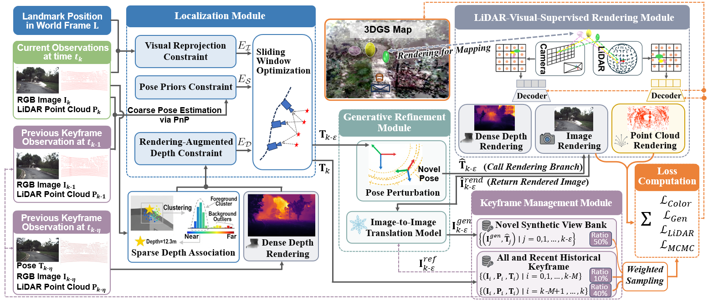
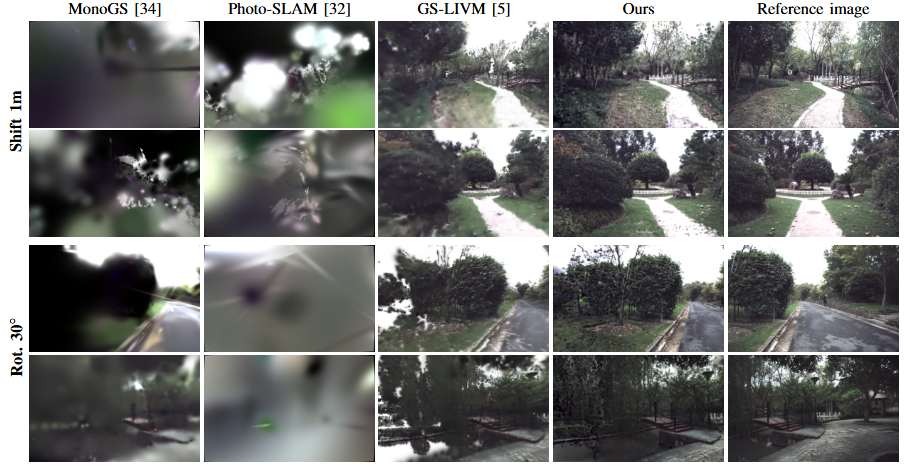
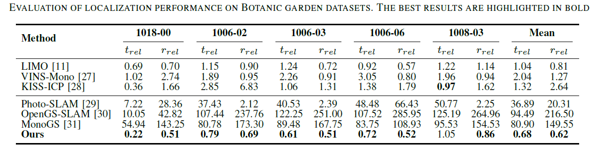
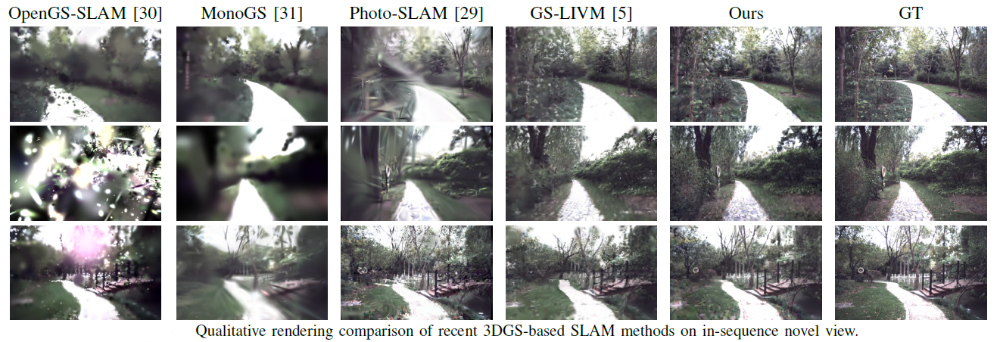
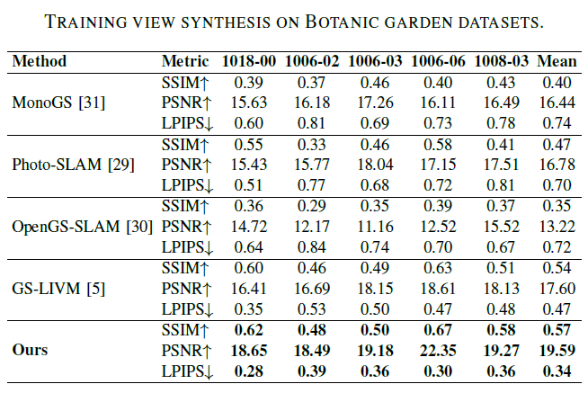
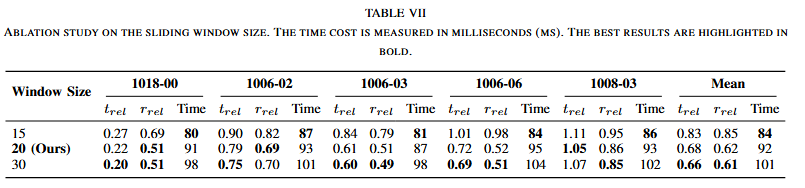

<h2 align="center">
  <strong>LVGS-SLAM: LiDAR-Visual-Supervised Gaussian Splatting SLAM with Dense Depth Rendering for Unstructured Environments</strong>
</h2>
<div align=center>

</div>

<div align=center>

</div>

<div align=center>

</div>

<div align=center>

</div>

<div align=center>

</div>

<div align=center>

</div>

# Installation
### 1. Installation of localization module 

**Prerequisites:**
*   Ubuntu 20.04 (ROS Noetic)
*   ROS Core System
*   `ceres-solver`
  
1.  **Install system & ROS dependencies:**
    ```bash
    sudo apt-get update && sudo apt-get install -y git libpng++-dev 
    sudo apt-get install -y python3-catkin-tools ros-noetic-opencv-apps
    ```
2.  **Create a catkin workspace :**
    ```bash
    mkdir -p ./catkin_ws/src
    cd ./catkin_ws
    catkin init
    cd ..
    mv ./SLAM/src/* ./catkin_ws/src
    ```
3.  **Install dependencies:**
    ```bash
    cd ./catkin_ws/src/limo
    bash install_repos.sh
6.  **Build the workspace:**

    ```bash
    cd ../
    catkin_make
    ```
    
### 2. Installation of mapping and refinement module 
1.  **Create a conda environment:**

    ```bash
    conda create -n LVGS python=3.10
    conda activate LVGS
    ```

2.  **Install CUDA 11.8:**
    ```bash
    pip install torch==2.0.1+cu118 torchvision==0.15.2+cu118 --extra-index-url https://download.pytorch.org/whl/cu118
    conda install -c "nvidia/label/cuda-11.8.0" cuda-toolkit
    pip install dill --upgrade
    pip install --upgrade pip "setuptools<70.0"
    pip install ninja git+https://github.com/NVlabs/tiny-cuda-nn/#subdirectory=bindings/torch
    ```
    
3.  **Install dependencies:**
    ```bash
    
    pip install waymo-open-dataset-tf-2-11-0==1.6.1

    cd neurad-studio
    #The `-e` flag installs the package in editable mode.
    pip install -e .
    pip install submodules/gsplat
    cd src
    pip install -e .
    ```
---
# Run

This project uses the [**BotanicGarden Dataset**](https://github.com/robot-pesg/BotanicGarden).

1.  **Download the Rosbag:** Obtain the dataset from its official source and place it in the directory specified in botanic.launch.
    

2. **Run SLAM**
    ```bash
    roslaunch test_ape test.launch
    ```

3.  **Run only the localization module.**
    ```bash
    roslaunch demo_keyframe_bundle_adjustment_meta botanic.launch
    ```
    

4.  **Run only the mapping and refinement module.** 
    ```bash
    python nerfstudio/scripts/train.py splatad-wild --vis viewer+tensorboard botanic-data
    ```
    
<!-- # License

This project is released under the **MIT License** (or specify your license, e.g., Apache 2.0). See the [LICENSE](LICENSE) file for details.

### Third-Party Code and Licenses
To facilitate out-of-the-box deployment, this repository contains or builds upon source code from several open-source libraries. All respective copyrights, trademarks, and licenses belong to their original authors:

* **limo**: Licensed under the GPL-3.0 License.
* **neurad-studio**: Licensed under the Apache License 2.0.
* **Difix3D**: Subject to the NVIDIA Source Code License / MIT License (depending on their exact repo spec).
* **nerfstudio & gsplat**: Licensed under the Apache License 2.0.

Please refer to the respective subfolders or original repositories for their full license texts. The inclusion of these components strictly complies with and operates under their original open-source licenses. -->

# Acknowledgements

Our work is built upon the following projects:
*   [**nerfstudio**](https://github.com/nerfstudio-project/nerfstudio)
*   [**neurad-studio**](https://github.com/georghess/neurad-studio)
*   [**limo**](https://github.com/johannes-graeter/limo)
*   [**Difix3D**](https://github.com/nv-tlabs/Difix3D)
*   [**img2img-turbo**](https://github.com/GaParmar/img2img-turbo)
*   [**GS-LIVM**](https://github.com/xieyuser/GS-LIVM)
  

We thank the authors and contributors of these repositories for making their work publicly available.
